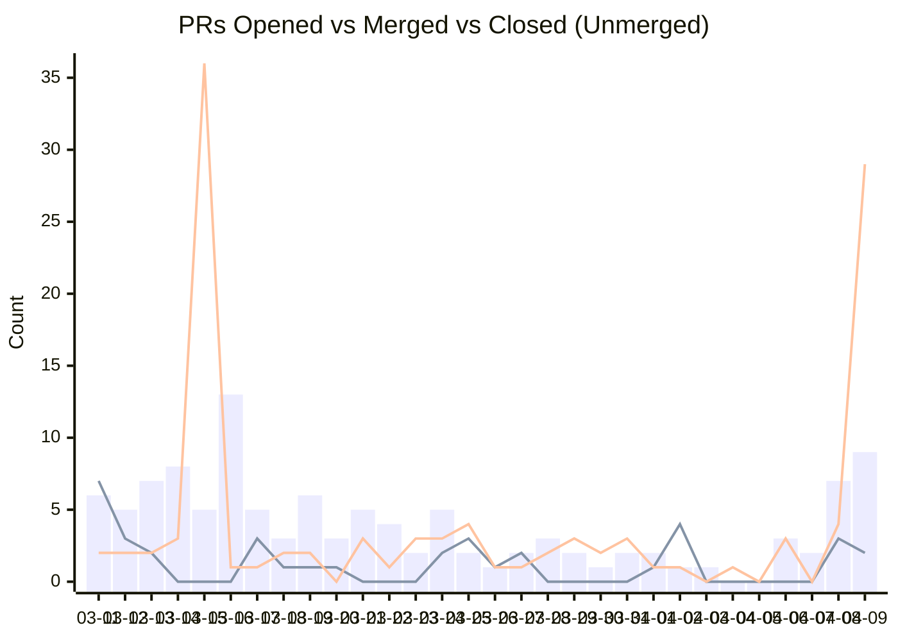
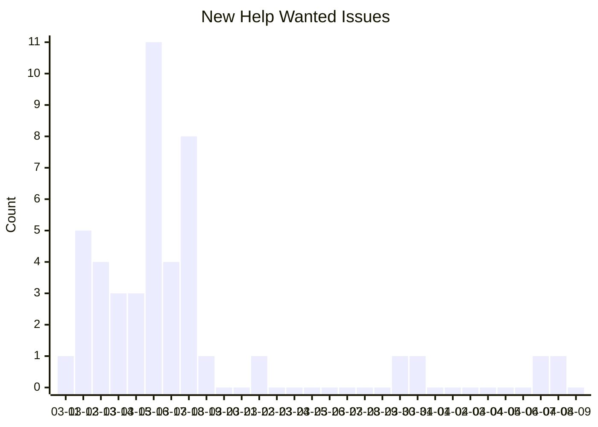
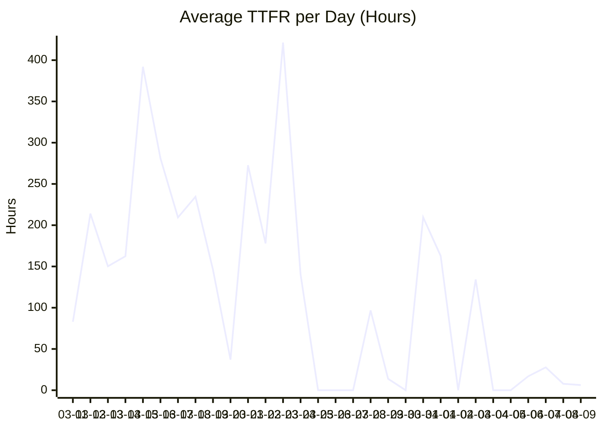
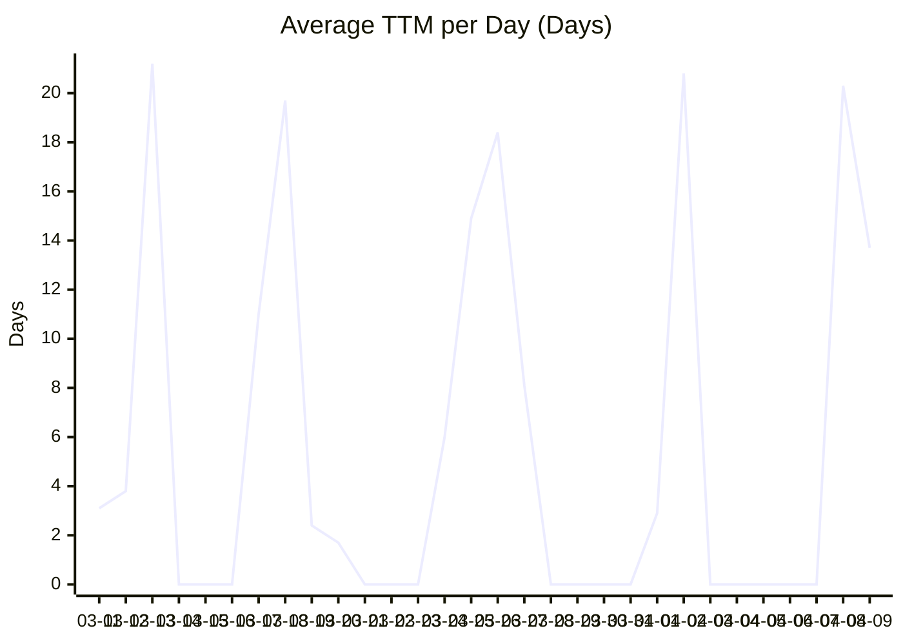
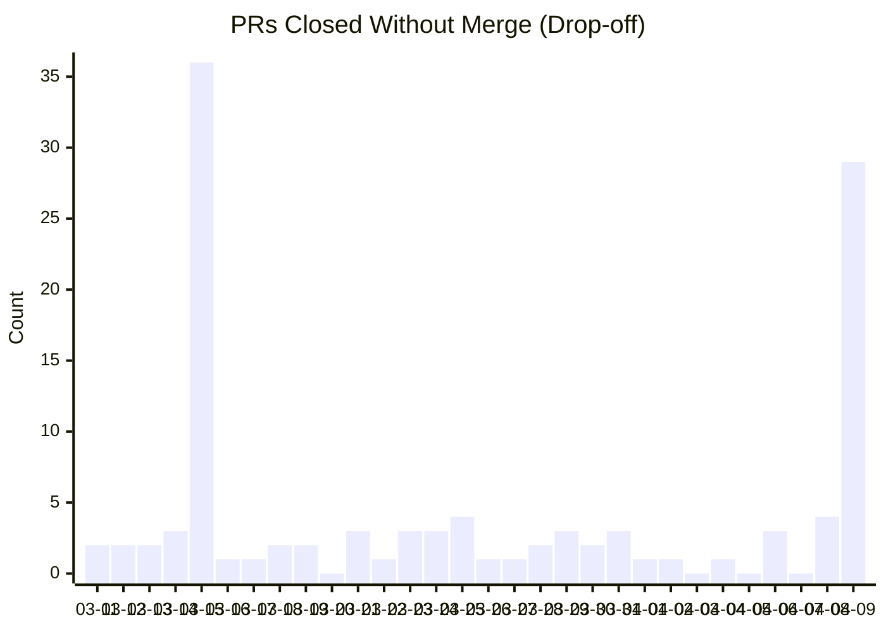

# 📈 Gemini CLI Contribution Metrics Dashboard

*Generated on 2026-04-10 (UTC). Reflects activity from the last 30 days.*

## 🚀 Velocity & Throughput
Tracks the sheer volume of contribution activity over the past 30 days.

### Daily Volume Activity

### Daily New Issues

| Metric | Last 30 Days | Calculation |
| :--- | :--- | :--- |
| 🆕 New Help Wanted Issues | **45** | Number of new issues created with the `help wanted` label. |
| 🛠️ PRs Opened | **123** | Number of new PRs opened linked to a `help wanted` issue. |
| 🟣 PRs Merged | **37** | Number of those linked PRs that were successfully merged. |
| ⚪ PRs Closed (Unmerged) | **124** | Number of those linked PRs that were closed without merging (e.g. abandoned, stale). |
| 🔄 Issue to PR Conversion Rate | **30.1%** | Percentage of opened PRs that successfully get merged (`Merged / Opened`). |

## ⏱️ Efficiency & Bottlenecks
Measures the speed and responsiveness of the maintainer team in processing community PRs.

### Time to First Review (TTFR) Trend

### Time to Merge (TTM) Trend

| Metric | Average | Calculation |
| :--- | :--- | :--- |
| ⚡ Time to First Review (TTFR) | **162.1 hours** | Average time from PR creation until the first comment or review from a maintainer. (Target: < 24h) |
| 🚢 Time to Merge (TTM) | **11.3 days** | Average time from PR creation to when it is successfully merged into the codebase. |

## ❤️ Community Health
Indicates the general success and retention rate of contributors attempting to resolve issues.

### Drop-off Trend

| Metric | Rate | Calculation |
| :--- | :--- | :--- |
| 📉 Author Drop-off Rate | **77.0%** | Percentage of closed PRs that were abandoned or unmerged out of all resolved PRs (`Unmerged / Total Closed`). High drop-off could mean tasks are too hard or setup is complex. |

---
*Metrics maintained by automated daily script.*