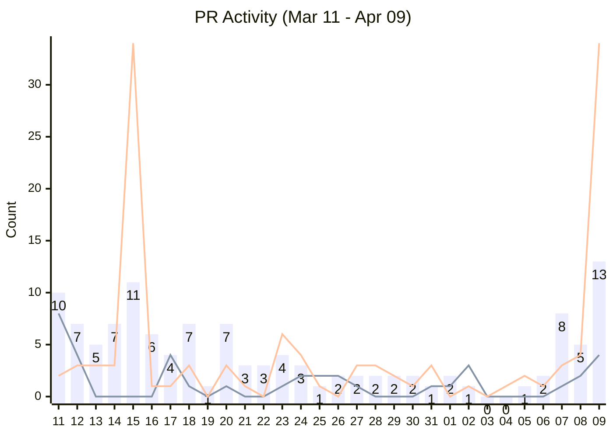
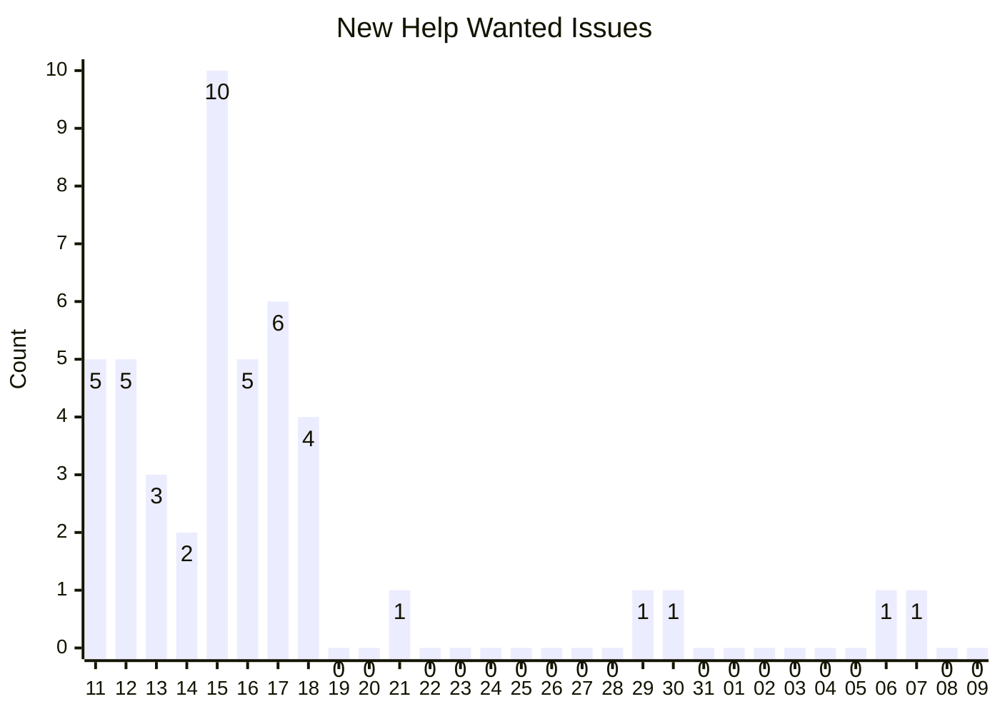
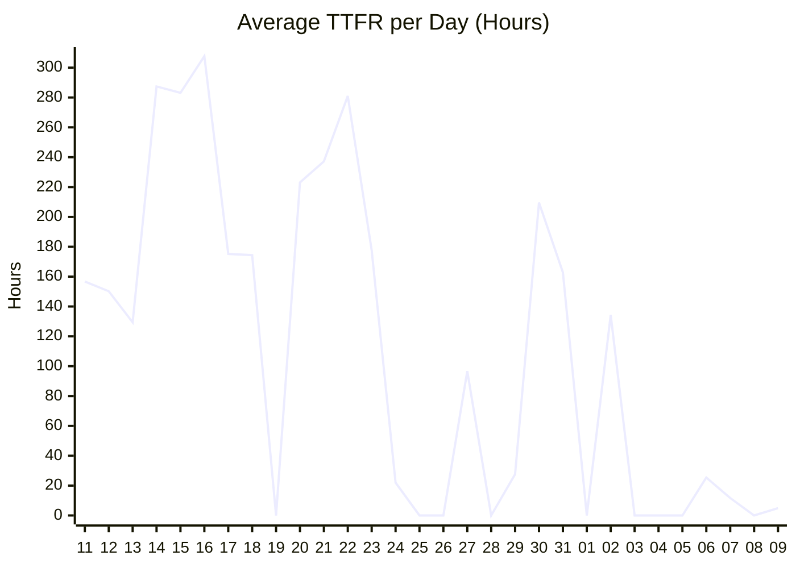
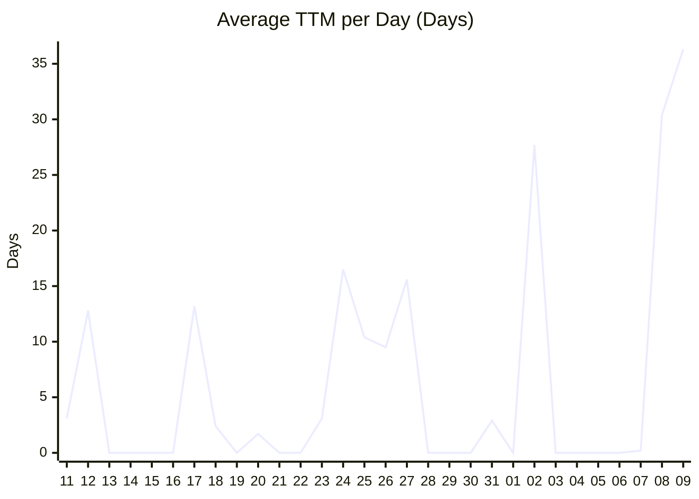
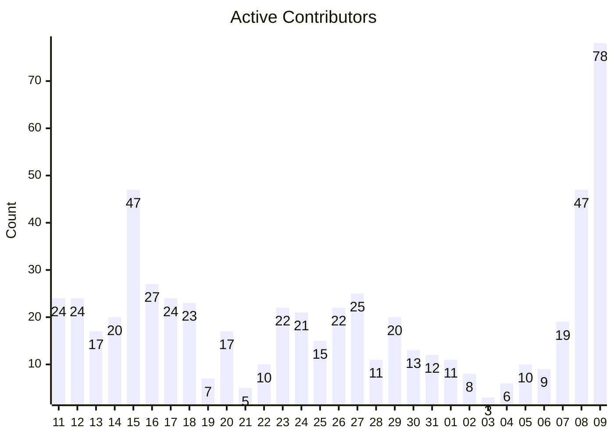
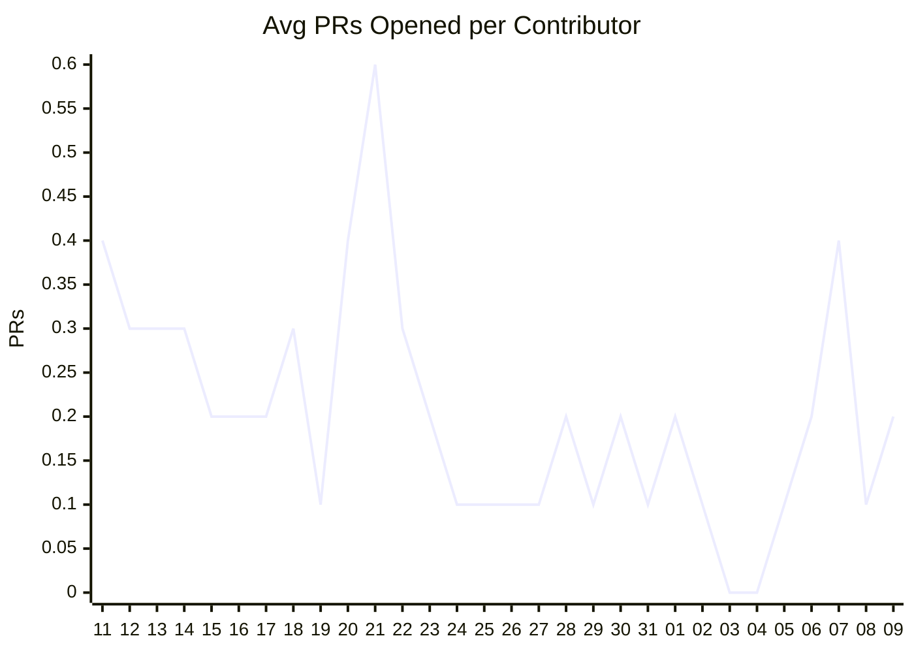
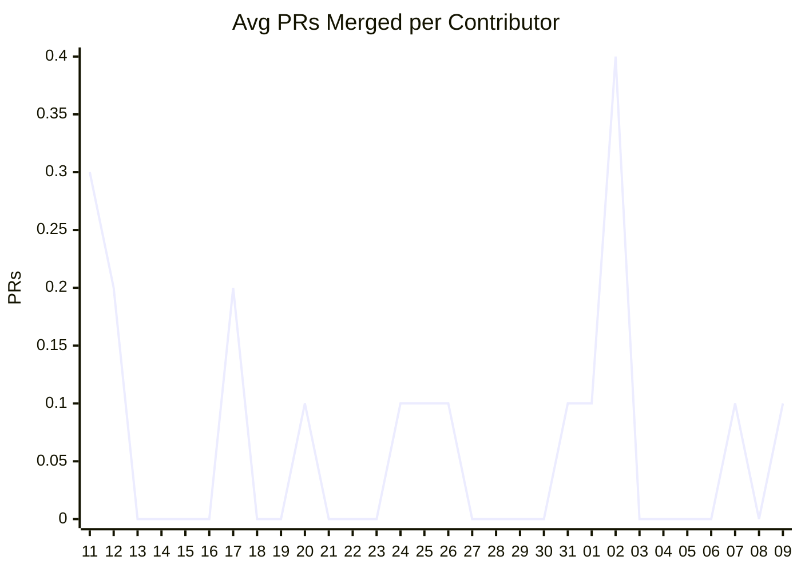

# 📈 Gemini CLI Contribution Metrics Dashboard

*Generated on 2026-04-10 (UTC). Reflects activity from the last 30 days.*

## 🚀 Velocity & Throughput
Tracks the sheer volume of contribution activity over the past 30 days.

### PRs Opened vs Merged vs Closed (Unmerged)
> **Legend:** 📊 Bar = PRs Opened | 📈 Line 1 = PRs Merged | 📉 Line 2 = PRs Closed (Unmerged)

### Daily New Issues
> **Legend:** 📊 Bar = New Help Wanted Issues

| Metric | Last 30 Days | Target / Goal | Calculation |
| :--- | :--- | :--- | :--- |
| 🆕 New Help Wanted Issues | **45** | Steady / Growing | Number of new issues created with the `help wanted` label. |
| 🛠️ PRs Opened | **122** | - | Number of new PRs opened linked to a `help wanted` issue. |
| 🟣 PRs Merged | **38** | Track closely to Opened | Number of those linked PRs that were successfully merged. |
| ⚪ PRs Closed (Unmerged) | **123** | - | Number of those linked PRs that were closed without merging (e.g. abandoned, stale). |
| 🔄 Issue to PR Conversion Rate | **31.1%** | > 50% | Percentage of opened PRs that successfully get merged (`Merged / Opened`). |

## ⏱️ Efficiency & Bottlenecks
Measures the speed and responsiveness of the maintainer team in processing community PRs.

### Time to First Review (TTFR) Trend
> **Legend:** 📈 Line = Average Time to First Review (in hours) for PRs opened on that day

### Time to Merge (TTM) Trend
> **Legend:** 📈 Line = Average Time to Merge (in days) for PRs successfully merged on that day

| Metric | Average | Target / Goal | Calculation |
| :--- | :--- | :--- | :--- |
| ⚡ Time to First Review (TTFR) | **162.1 hours** | < 168 hours (1 week) | Average time from PR creation until the first comment or review from a maintainer. |
| 🚢 Time to Merge (TTM) | **13.6 days** | < 14 days (2 weeks) | Average time from PR creation to when it is successfully merged into the codebase. |

## ❤️ Community Health
Indicates the general success and retention rate of contributors attempting to resolve issues.

| Metric | Rate | Target / Goal | Calculation |
| :--- | :--- | :--- | :--- |
| 📉 Author Drop-off Rate | **76.4%** | < 20% | Percentage of closed PRs that were abandoned or unmerged out of all resolved PRs (`Unmerged / Total Closed`). High drop-off could mean tasks are too hard or setup is complex. |

### 👥 Contributor Engagement
> **Legend:** 📊 Bar = Number of unique active contributors (opened, merged, closed, reviewed, commented, or committed)

> **Legend:** 📈 Line = Avg PRs Opened per Active Contributor

> **Legend:** 📈 Line = Avg PRs Merged per Active Contributor

| Metric | Value | Target / Goal | Calculation |
| :--- | :--- | :--- | :--- |
| 🧑‍💻 Total Active Contributors | **400** | Steady Growth | Number of unique human contributors who opened, merged, closed, reviewed, commented, or committed to a PR or Issue in the last 30 days. |
| 📈 Avg PRs Opened | **0.3** | > 1.5 PRs | Total PRs opened divided by total active contributors over 30 days. |
| 🎯 Avg PRs Merged | **0.1** | > 1.5 PRs | Total PRs merged divided by total active contributors over 30 days. |

---
*Metrics maintained by automated daily script.*